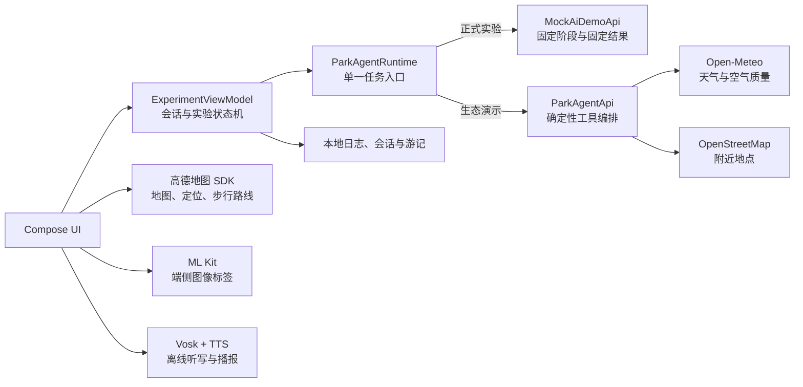
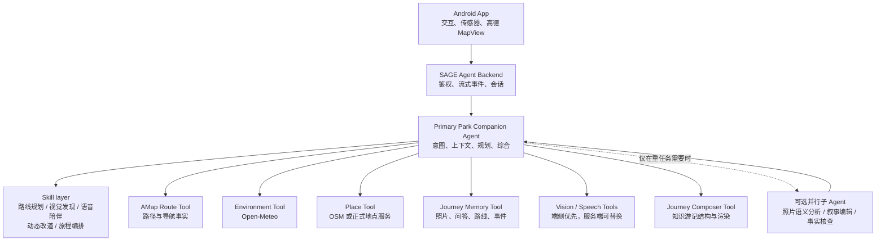

# SAGE AI Native Agent 产品架构

## 结论

SAGE 现阶段采用 **一个主 Agent + skills + typed tools** 最合适，不需要把每项能力都拆成独立子 Agent。

- 主 Agent 负责理解当前任务、维护旅程上下文、选择工具、组合结果和解释不确定性。
- Skill 是可复用的任务方法与约束，例如路线规划、视觉发现、语音陪伴、动态改道和游记编排。
- Tool 是能真实读取数据或执行动作的代码接口，例如高德路线、天气、地点检索、端侧视觉、语音和本地存储。
- 子 Agent 只在任务可以真正独立并行、需要独立上下文或专业评审时引入；它不是工具数量增加后的默认选择。

因此，产品对用户始终表现为一个连续的“银小叶公园陪伴 Agent”，不会让用户在多个机器人之间切换。

## 当前实现的真实状态

当前 APK 还没有接入大模型。它是一个可复现的确定性 Agent runtime：

`AiDemoApi` 是稳定的智能层边界；`ParkAgentRuntime` 负责选择正式实验或生态演示实现。这样 ViewModel 不再负责组装具体工具，后续替换为服务端模型时 UI 和任务状态机不需要重写。

## 推荐目标架构

### 主 Agent 的职责

1. 维护一次公园旅程的连续上下文，不让 A、B1、B2、C、D 变成割裂功能。
2. 根据用户意图选择 skill，再按需调用一个或多个工具。
3. 区分事实、模型推断和实验脚本；在结果中保留来源、时间与不确定性。
4. 允许用户随时修改约束、拒绝建议、回退或重新规划。
5. 把工具结果整理为稳定的 UI 事件：`StageChanged` 与 `Completed`。

### Skills 不是独立模型

| Skill | 主要输入 | 可调用工具 | 产出 |
|---|---|---|---|
| 路线规划 | 偏好、时间、环境约束 | 高德路线、天气 | 推荐/备选路线及依据 |
| 视觉发现 | 照片、圈选区域、问题 | ML Kit、未来多模态视觉 | 可核查的视觉线索与问答 |
| 语音陪伴 | 转写文本、当前路线 | Vosk、地点、天气、TTS | 上下文回答与播报 |
| 动态改道 | 封路、降雨、人流等变化 | 高德路线、天气 | 新旧路线权衡 |
| 旅程编排 | 路线、照片、问答、行为 | 本地记忆、渲染器 | 知识游记与分享素材 |

Skill 应主要存在于服务端的指令、策略和工作流中；Tool 应是有 schema、超时、权限、来源和失败语义的代码接口。

## 何时才需要多 Agent

| 场景 | 推荐方案 | 原因 |
|---|---|---|
| 路线、天气、地点、语音等实时交互 | 单主 Agent 调用工具 | 决策链连续，延迟和可控性更重要 |
| 正式实验 | 确定性 runtime | 避免模型随机性和网络波动成为混淆变量 |
| 最终游记的照片分析、叙事编辑、事实核查 | 可选并行子 Agent | 三项工作可独立处理，再由主 Agent 综合 |
| 长时间跨来源公园研究 | 可选研究子 Agent | 独立上下文和并行检索能带来明显收益 |
| 只是多调用几个 API | 不拆子 Agent | 工具编排已经足够，拆分会增加延迟、成本和调试难度 |

即使未来使用子 Agent，也应由主 Agent 统一收口，子 Agent 不直接接管用户会话。路线和安全相关事实必须由高德等 typed tool 验证，不能仅凭子 Agent 文本输出。

## 两套运行模式必须分开

### 正式实验模式

- 使用 `MockAiDemoApi` 固定输入、阶段、时序与结果。
- 关闭外部模型和实时数据，确保条件比较可复现。
- 继续记录相同的日志、任务后量表和完成时间。

### AI Native 生态演示模式

- Android 通过项目后端连接主模型，后端再调用模型和联网工具。
- 服务端流式进度继续映射为 `AiTaskEvent.StageChanged`，结构化结果映射为 `Completed`。
- 界面明确显示“实时工具”“缓存”“模型推断”“离线回退”等来源状态。

两种模式共用 UI 和任务协议，但数据不能混在同一组正式实验分析中。

## 安全与工程边界

- 大模型 API Key 只保存在项目后端，绝不能写进 APK、`local.properties` 提交内容或客户端请求日志。
- 高德 `MapView`、定位、`RouteSearchV2` 和原生 `Polyline` 继续保留；主 Agent 只发出路线意图和约束，不自行伪造路径几何。
- 端侧照片与语音默认本机处理。若未来上传，必须显式征得同意并说明保存期限。
- 每个工具返回结构化 provenance：工具名、时间、数据源、是否缓存、失败原因。
- 涉及封路、天气、安全或营业状态时，结果必须提示用户现场核查。

## 迁移路线

1. **已完成：运行时收口。** 由 `ParkAgentRuntime` 统一选择离线与联网编排实现。
2. **定义工具协议。** 为 Route、Environment、Place、Vision、Speech、Memory、Journey 统一输入输出与 provenance。
3. **新增服务端 `RemoteAgentApi`。** 使用流式接口实现现有 `AiDemoApi` 协议，客户端不保存模型密钥。
4. **接入一个主模型。** 先覆盖语音问答与路线约束解释，保留高德和确定性评分作为事实/降级路径。
5. **建立评测。** 检查工具选择正确率、无数据时拒绝虚构、路线事实一致性、端到端延迟和中断恢复。
6. **按收益引入子 Agent。** 只在游记生成或跨来源研究证明并行收益后启用。

## 近期最值得继续改的产品点

1. 把“工具调用过程”变成可展开的依据卡：调用了什么、为什么调用、成功/缓存/失败。
2. 给 Agent 增加旅程级记忆摘要，避免重复进入语音或改道任务时丢失前文。
3. 让高德路线成为唯一空间事实源，天气、照片、语音节点只作为路线上的语义层叠加。
4. 为生态演示增加可观测指标：首 token/首阶段延迟、工具耗时、重试、回退、用户改写次数。
5. 用一组固定任务做回归评测，再决定是否值得引入多 Agent，而不是先按组织结构拆模型。

实现模型编排时优先使用支持结构化工具调用和流式状态的服务端 API。OpenAI 当前模型指南也建议在推理、工具调用和多轮工作流中使用 Responses API，并只向模型暴露当前任务真正需要的工具：[OpenAI model guidance](https://developers.openai.com/api/docs/guides/latest-model)。
