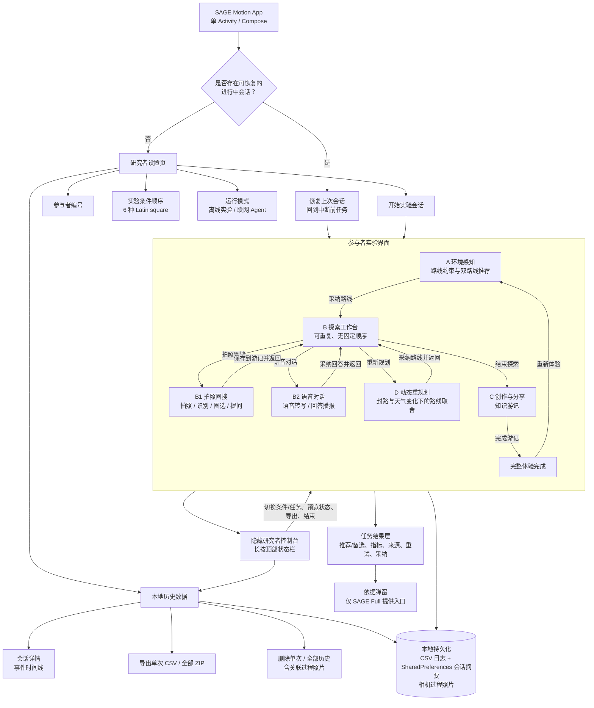
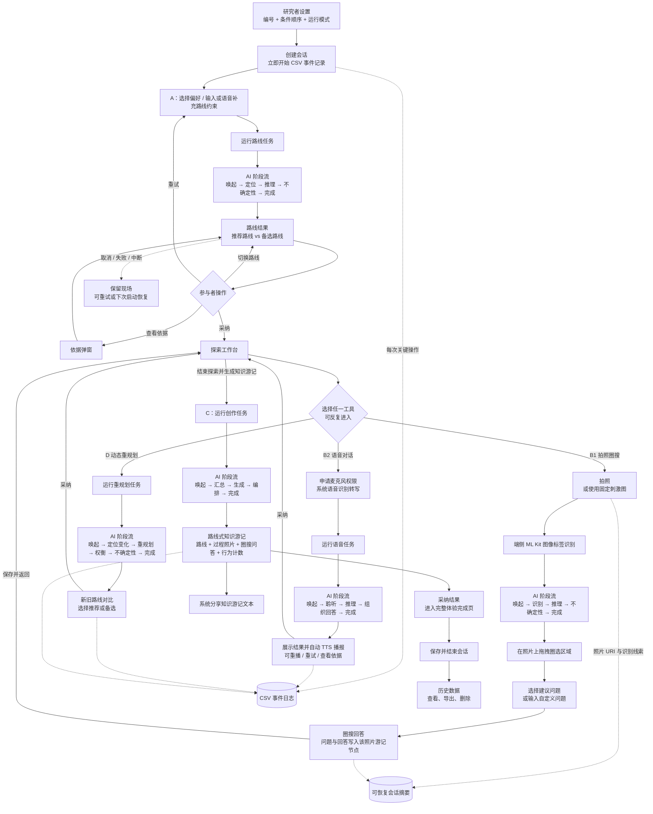
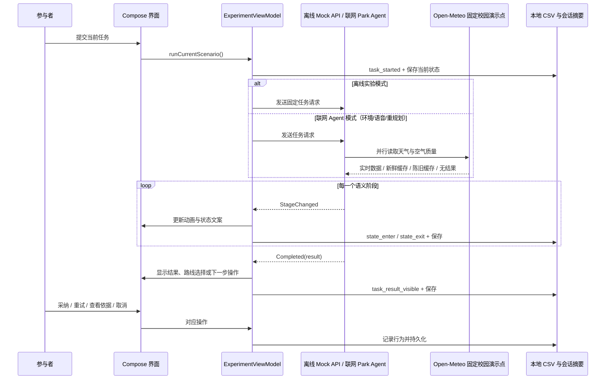

# SAGE Motion：信息架构与核心交互流程

依据 `app/src/main` 的 Compose 页面、`ExperimentViewModel` 状态机、数据层与项目说明整理。图中“参与者”指正常体验路径；“研究者”指长按顶部状态栏后出现的受控入口。

## 1. 信息架构

信息层级的关键点：A 是主路径的必经起点；B 是并行工具工作台，B1、B2、D 可以任意顺序并反复进入；C 由用户主动结束探索后进入。三种实验条件不改变任务结构，只改变 AI 状态与反馈呈现：Baseline、Semantic Motion、SAGE Full（额外呈现不确定性、依据和接管入口）。

## 2. 核心交互流程

## 3. 任务运行与数据来源

联网模式不会读取或上传参与者的位置。视觉任务的图像标签识别在端侧 ML Kit 执行；当联网环境数据不可用时，Agent 会保留离线脚本结果并标注回退来源。
